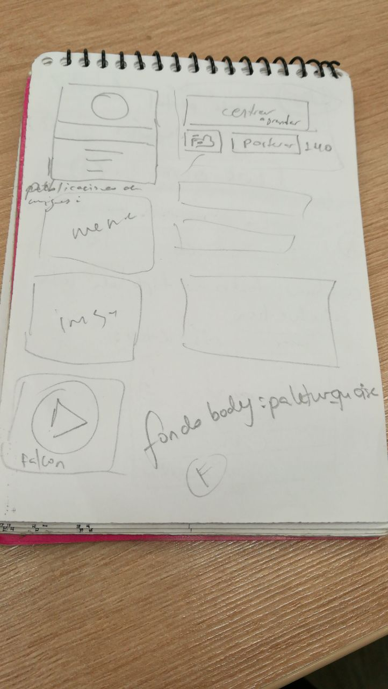

# Social Network

## ¿En que consiste nuestro trabajo?

#### Creamos una red social para programadores en la cual se podra agregar imagenes o postear diferentes códigos de diversos lenguajes de programación. Al hacerlo, muchas personas podran tener acceso con solo copiar y pegar el mismo, aparte de que podran comentar el posteo, por ejemplo, para aclarar dudas o agregar más lineas de código.   

## ¿Porque para programadores?

#### Debido al crecimiento tecnológico que hay, se requiere que más personas adquieran conocimientos de programación; por tal motivo creamos RESPONSIVE CODE

### ¿Si es una red social porque nuestra pagina no tiene un chat?
#### Porque nos pareció indispensable ya que las publicaciones que haga un usuario serán publicas por lo tanto todos pueden acceder a ellas sin necesidad de un permiso.

## Organizacion:

#### Imagenes del planteamiento de la web

#### Mobile

#### Desktop

